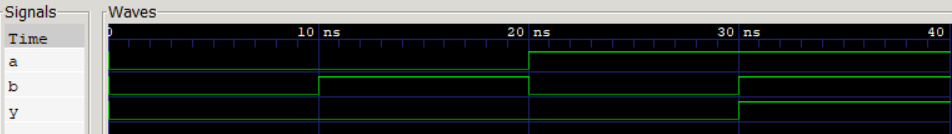

## Simple AND Gate Design in Verilog

## Project Overview
This project implements a basic 2-input **AND gate** using Verilog HDL. The primary goal was to establish a complete hardware design workflow, including RTL coding, testbench creation, and functional simulation.

## Logic Description
An AND gate is a fundamental digital logic gate that outputs '1' (high) only if all its inputs are '1'.
The Boolean expression is:  
$Y = A \cdot B$

### Truth Table
| Input A | Input B | Output Y |
| :---: | :---: | :---: |
| 0 | 0 | 0 |
| 0 | 1 | 0 |
| 1 | 0 | 0 |
| 1 | 1 | 1 |

## Tools Used
* **Language:** Verilog HDL
* **Simulator:** Icarus Verilog
* **Waveform Viewer:** GTKWave
* **Editor:** VS Code

## Implementation

### RTL Design (`and_gate.v`)
The logic is implemented using a simple continuous assignment:
```verilog
module and_gate (
    input wire A,
    input wire B,
    output wire Y
);
    assign Y = A & B;
endmodule
```

## Simulation Results
The following waveform demonstrates the correct functional behavior of the AND gate:


