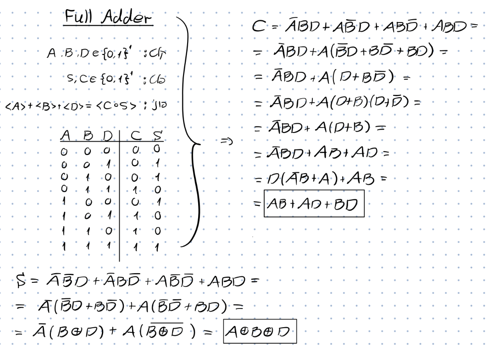
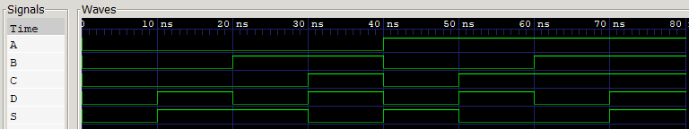

# 1-Bit Full Adder Design in Verilog

## Project Overview
This project implements a **1-bit Full Adder** using Verilog HDL. The design process included deriving Boolean expressions from a truth table, implementing the logic in RTL, and verifying the functionality through simulation with Icarus Verilog and GTKWave.

## Logic Description
A Full Adder adds three one-bit binary numbers ($A$, $B$, and a carry-in $D$) and outputs a sum ($S$) and a carry-out ($C$).

### Truth Table
| Input $A$ | Input $B$ | Input $D$ (Cin) | Output $C$ (Cout) | Output $S$ (Sum) |
| :---: | :---: | :---: | :---: | :---: |
| 0 | 0 | 0 | 0 | 0 |
| 0 | 0 | 1 | 0 | 1 |
| 0 | 1 | 0 | 0 | 1 |
| 0 | 1 | 1 | 1 | 0 |
| 1 | 0 | 0 | 0 | 1 |
| 1 | 0 | 1 | 1 | 0 |
| 1 | 1 | 0 | 1 | 0 |
| 1 | 1 | 1 | 1 | 1 |

## Logic Derivation
Based on the truth table, the following optimized Boolean expressions were used:
* **Sum:** $S = A \oplus B \oplus D$
* **Carry-Out:** $C = AB + AD + BD$

The handwritten derivation process is shown below:


## Tools Used
* **Language:** Verilog HDL
* **Simulator:** Icarus Verilog
* **Waveform Viewer:** GTKWave
* **Editor:** VS Code

## Implementation

### RTL Design (`full_adder.v`)
The logic is implemented using continuous assignments for better hardware mapping:
```verilog
module full_adder (
input wire A,
input wire B,
input wire D, // Carry in
output wire C, // Carry out
output wire S // Sum
);
    assign S = A ^ B ^ D;
    assign C = (A & B) | (A & D)| (B & D);

endmodule
```

## Simulation Results
The design was verified by a testbench covering all 8 possible input combinations. The simulation confirms that the circuit behaves exactly as defined by the truth table.

